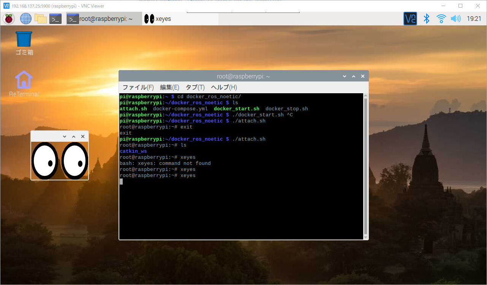
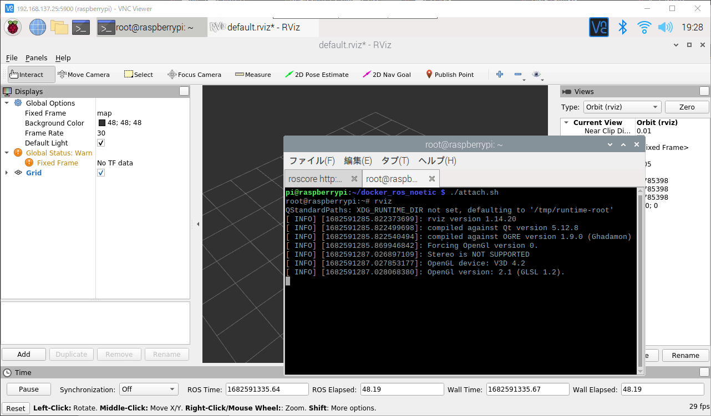
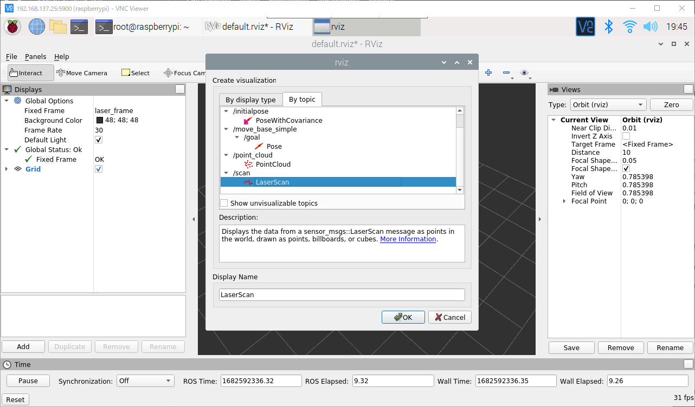

# lecture_raspi

`Raspberry Pi 4 or 3`に`Docker`をインストールし、`ROS`を動作させる。

## Raspbian OS

- [Raspberry Pi OS](https://www.raspberrypi.com/software/)から`Raspberry Pi Imager`をダウンロードして`Raspbian`をインストールする。

## Dockerのインストール

```shell
sudo apt update && sudo apt upgrade -y
curl -fsSL https://get.docker.com -o get-docker.sh
sudo sh get-docker.sh
sudo usermod -aG docker ${USER}
sudo pip3 install docker-compose
```

`docker-compose`インストール時にエラーが発生した場合は以下を実行する。

```shell
sudo apt purge python3-openssl 
sudo pip3 uninstall pyopenssl
sudo pip3 install pyopenssl
sudo pip3 install --upgrade requests
sudo pip3 install docker-compose
```

`Emacs`テキストエディタもインストールしておく。

```shell
sudo apt install emacs
```

## DockerからGUIアプリが使えるようにする

[Dockerコンテナ内のX11 GUIアプリを使用する](https://qiita.com/nobrin/items/59b9b645e5595365c4ac)を参照。

ホスト（Raspberry Pi）側で以下を実行する。これは`Raspberry Pi`を起動するたびに必要。

```shell
xhost +local:
```

もしも、自動的にこの設定をしたい場合は`/etc/profile`の末尾に`xhost +local:`を追記する。

```text
sudo emacs /etc/profile -nw
# テキストエディタが開くので、末尾に「xhost +local:」と追記。
```

追記できたら、`Ctrl+X`を押して離して、`Ctrl+S`で保存する。
さらに`Ctrl+X`を押して離して、`Ctrl+C`で`Emacs`を終了させる。

## 起動

ホスト側で以下を実行して`Docker`コンテナを起動する。

```shell
cd 
git clone https://github.com/KMiyawaki/docker_ros_noetic.git
cd docker_ros_noetic
./docker_start.sh
```

以下を実行して、コンテナ内で作業する。

```shell
cd ~/docker_ros_noetic
./attach.sh
```

### コンテナの初期設定

必要なパッケージをインストールする。以下は、`./attach.sh`実行後の**コンテナ内**での作業であることに注意。

コマンドターミナルのプロンプトが`root@raspberrypi:~#`となっていれば良い。

```shell
cd
sudo apt update && sudo apt install git -y
git clone https://github.com/KMiyawaki/setup_robot_programming
cd setup_robot_programming
./init_workspace.sh
./install_ros_packages.sh
sudo apt install iputils-ping net-tools x11-apps -y
sudo apt install ros-noetic-media-export -y
sudo apt install python-is-python3 -y
./upgrade_packages.sh
exit # 一旦コンテナを抜ける。他にもコンテナに入っているターミナルがあれば全てexitする。
```

次のコマンドでRVizの起動をテストする。以下いずれのコマンドも`./attach.sh`後の**コンテナ内で**実行すること。

```shell
xeyes
```

次のように、目玉のマークが表示されれば成功。`Ctrl＋C`キーで終了させる。



`roscore`を起動する。`./attach.sh`したコンテナ内で実行すること。

```shell
roscore
... logging to /root/.ros/log/ce235914-e4e5-11ed-8e14-e45f013e9eb3/roslaunch-raspberrypi-9023.log
# 省略・・・
started core service [/rosout]
```

もう一つ別のターミナルで`./attach.sh`し、`RViz`を起動する。

```shell
rviz
QStandardPaths: XDG_RUNTIME_DIR not set, defaulting to '/tmp/runtime-root'
# 省略・・・
```



### YDLidar X4を動かす

**まず、ホスト（Raspberry Pi）側**で作業する。

```shell
# ホスト側
cd 
git clone https://github.com/YDLIDAR/YDLidar-SDK.git
cd YDLidar-SDK/startup
sudo sh initenv.sh
ls /dev|grep yd
ydlidar # これが出力されればOK.
```

次に**コンテナに**`./attach.sh`して以下を実行する。

```shell
cd ~/catkin_ws/src
git clone https://github.com/KMiyawaki/oit_navigation_minibot_light_01.git
cd oit_navigation_minibot_light_01
./install.sh
ls /dev|grep yd
ydlidar # コンテナ側でもこれが出力されればOK.
roslaunch ydlidar_ros_driver X4.launch
# YDLidarが回転する
```

新しい端末で`attach.sh`し、コンテナ内で`RViz`を起動する。

```shell
rviz -f laser_frame
```

`Add`->`By topic`->`/scan`を選択して追加すると`YDLidar`のデータが表示される。



### docker-compose.ymlの補足

`docker-compose`を使わない場合のコンテナの作成は以下で行える。

```shell
docker run -it --privileged ros:noetic
# または
docker run -it --security-opt seccomp:unconfined ros:noetic
```

オプションをつけない場合、以下のエラーが出る。

```shell
Fatal Python error: pyinit_main: can't initialize time
Python runtime state: core initialized
PermissionError: [Errno 1] Operation not permitted

Current thread 0xb6feb460 (most recent call first):
<no Python frame>
```

- 参考[Can you install Noetic with Docker on a Raspberry Pi?](https://answers.ros.org/question/359069/can-you-install-noetic-with-docker-on-a-raspberry-pi/)

## コンテナ内で追加インストール

- RVizを起動したときのエラー`[rospack] Error: no such package media_export`に対し、`sudo apt install ros-noetic-media-export`を行う。

## reTerminal固有の事項

`apt upgrade`後にモニタが映らなくなることがある。

- [reTerminalを使ってみる！](https://pocketgriffon.hatenablog.com/entry/2022/03/13/010200)

[reTerminalのCompute Module 4を入れ替える](https://lab.seeed.co.jp/entry/2021/07/13/120000)の「ドライバーをインストールする」を参照。

```shell
git clone --depth 1 https://github.com/Seeed-Studio/seeed-linux-dtoverlays
cd seeed-linux-dtoverlays
git fetch --tags
git checkout 2022-05-29-reTerminal-V1.9 # 最新版ではビルドできない場合がある。
sudo ./scripts/reTerminal.sh
sudo reboot
```

## 参考文献

1. [Raspberry Pi 4でDockerのインストール方法 2023年度版](https://raspida.com/rpi4-docker-install)
2. [Dockerを用いてRaspberryPi3上でROSを使ってみる](https://qiita.com/Spritaro/items/92e504023c2653595e79)
3. [Docker コンテナ内のGUIアプリを起動してホスト側に表示する](https://zukucode.com/2019/07/docker-gui-show.html)
